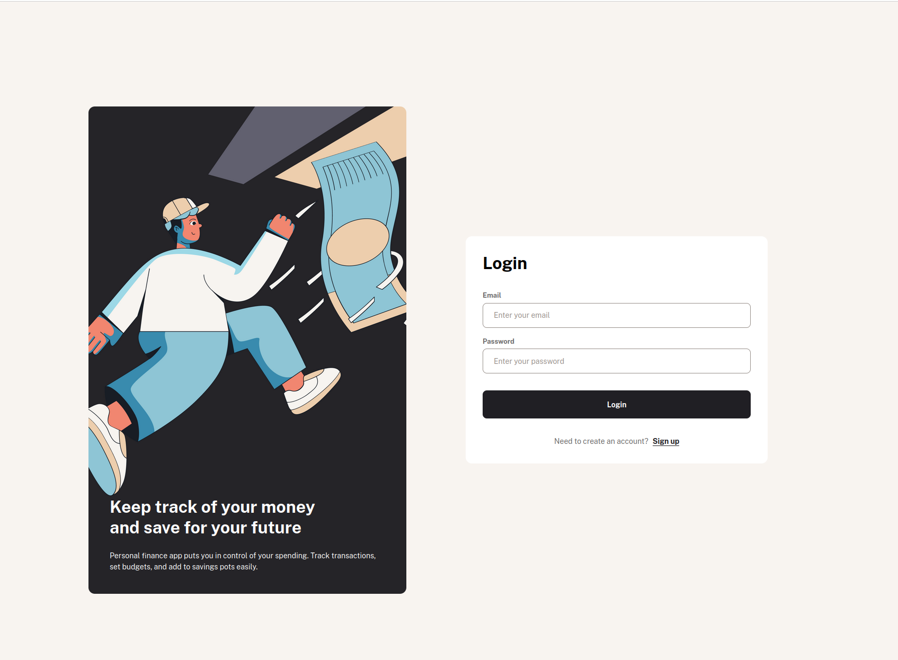

## 🔗 Live Demo

[Visit Finance](https://finance-sigma-ecru.vercel.app/)

## Default credentials (For demo purposes)
Email: test@example.com
Password: password
# Finance App
A modern, comprehensive personal finance management application that empowers users to track their spending, manage budgets, and save money through customizable pots. The platform features a clean, responsive interface for users and detailed financial insights.
### 📸 Screenshots

#### Home Page
#### Login Page

#### Overview Dashboard

#### Transactions Page

#### Budgets Page

####  Pots

#### Weekly Email Summary

## ✨ Features

### User Features
- **Dashboard Overview**: Get a quick glance at your financial health
- **Transaction Tracking**: Log and categorize all income and expenses
- **Budget Management**: Set and monitor spending limits across categories
- **Savings Pots**: Create and track progress towards savings goals
- **Weekly Transaction Summaries**: Automated emails with transaction details
- **PDF Attachments**: Downloadable transaction reports
- **Responsive Design**: Enjoy a seamless experience on any device

## 🛠️ Technologies Used

### Frontend
- **Vue.js**: Progressive JavaScript framework for building user interfaces
- **CSS**: For styling

### Backend
- **Laravel**: PHP framework for web application development
- **MySQL**: Relational database management system
- **Laravel Sanctum**: Authentication system for SPAs and simple APIs
- **Redis**: Key-Value Database for caching

### DevOps
- **Docker**: Containerization for consistent development and deployment
- **GitHub Actions**: CI/CD pipeline for automated testing and deployment
- **Vercel/Laravel Cloud**: Frontend/Backend hosting and deployment

## 📋 Prerequisites

- PHP 8.1 or higher
- Node.js 16.x or higher
- MySQL 8.0 or higher
- Composer
- npm or yarn
- docker

## 🚀 Installation

# Backend
- git clone https://github.com/Mckaay/Finance.git
- cd backend
- cp .env.example .env
- composer install
- ./vendor/bin/sail up -d
- ./vendor/bin/sail php artisan migrate:fresh --seed
- ./vendor/bin/sail php artisan key:generate

# Frontend
- git clone https://github.com/Mckaay/Finance.git
- cd frontend
- create .env file and put there VITE_API_URL=http://localhost:80
- npm install
- npm run dev